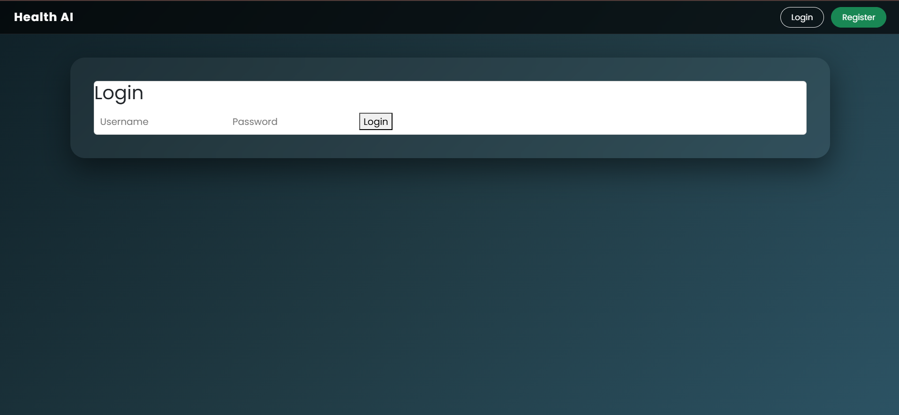
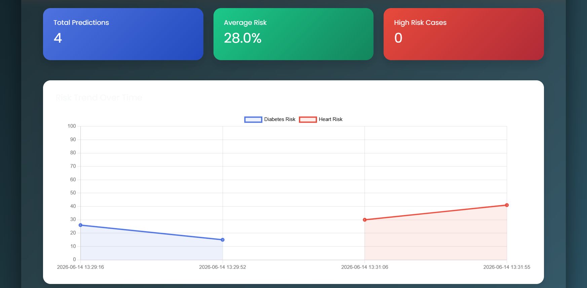
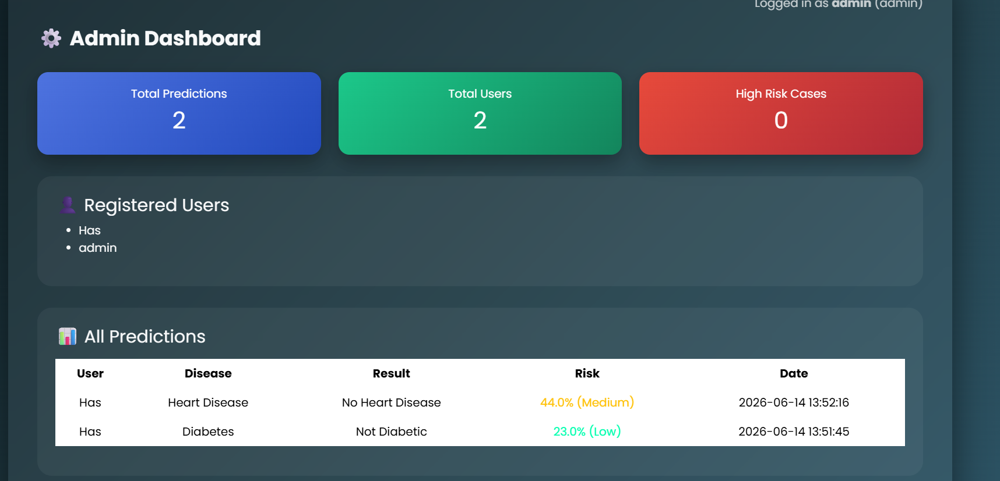
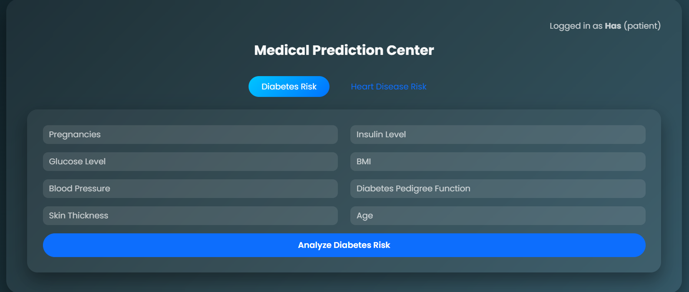
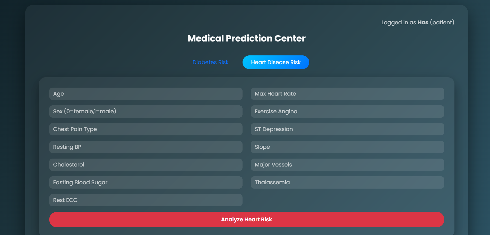
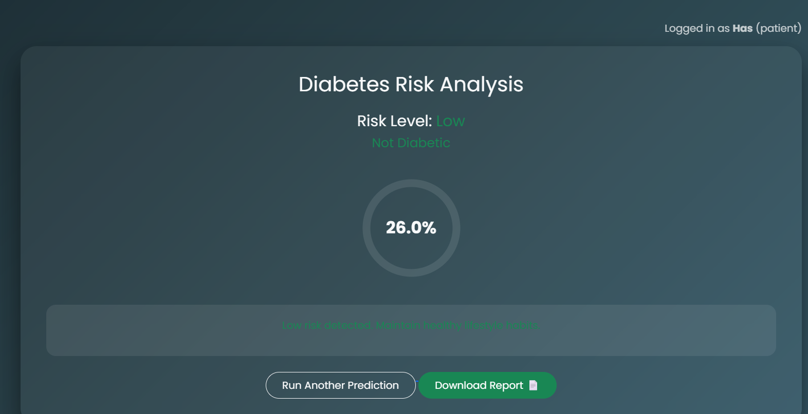
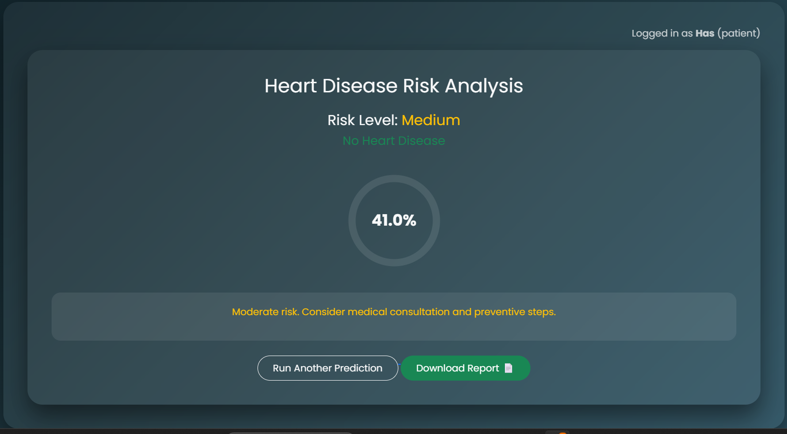
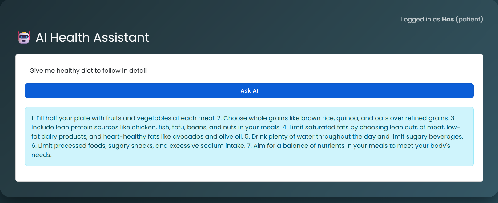
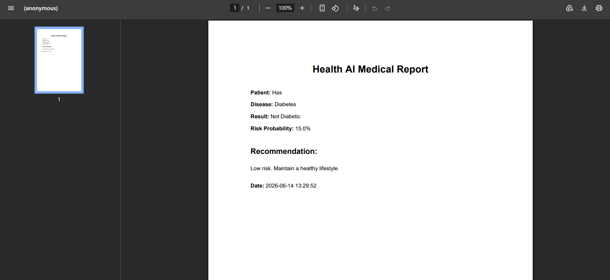

# 🏥 Health AI System

[](https://health-prediction-y827.onrender.com)


An AI-powered healthcare platform that predicts the risk of Diabetes and Heart Disease using Machine Learning and provides intelligent health insights through an AI assistant, analytics dashboard, and downloadable medical reports.

## 🌐 Live Demo

https://health-prediction-y827.onrender.com

## 🚀 Features

### 🔐 User Authentication

* User Registration and Login
* Secure password hashing
* Session management

### 🩺 Disease Prediction

* Diabetes Risk Prediction
* Heart Disease Prediction
* Instant prediction results
* Probability-based risk assessment

### 🤖 AI Health Assistant

* Interactive healthcare chatbot
* Answers health-related queries
* Provides personalized health guidance

### 📊 Analytics Dashboard

* Visual representation of prediction history
* Interactive charts and graphs
* User health trends and insights

### 📄 PDF Report Generation

* Downloadable medical reports
* Includes prediction results and recommendations
* Easy sharing and record keeping

### 📈 Data Visualization

* Statistical graphs
* Risk distribution charts
* Health analytics dashboard

### ☁️ Cloud Deployment

* Deployed on Render
* Accessible from anywhere through the web

---

## 🛠️ Tech Stack

### Backend

* Python
* Flask

### Machine Learning

* Scikit-Learn
* NumPy
* Pandas
* Joblib

### Frontend

* HTML5
* CSS3
* Bootstrap
* JavaScript
* Chart.js

### Database

* SQLite

### Additional Libraries

* ReportLab
* Requests
* Bcrypt
* Gunicorn

---

## 🧠 Machine Learning Models

### Diabetes Prediction

* Dataset preprocessing
* Feature engineering
* Classification model
* Real-time inference

### Heart Disease Prediction

* Medical feature analysis
* Disease risk prediction
* Probability estimation

---

## 📂 Project Structure

```text
Health_prediction/
│
├── app.py
├── requirements.txt
├── database.db
├── train_models.py
├── models/
│   ├── diabetes_model.pkl
│   └── heart_model.pkl
│
├── data/
│   ├── diabetes.csv
│   └── heart.csv
│
├── templates/
│   ├── login.html
│   ├── register.html
│   ├── dashboard.html
│   ├── diabetes.html
│   ├── heart.html
│   └── chatbot.html
│
├── static/
│   ├── css/
│   ├── js/
│   └── images/
│
└── README.md
```

---

## ⚙️ Installation

### Clone Repository

```bash
git clone https://github.com/hasinichandana/Health_prediction.git
cd Health_prediction
```

### Create Virtual Environment

```bash
python -m venv venv
```

### Activate Environment

Windows

```bash
venv\Scripts\activate
```

Linux/Mac

```bash
source venv/bin/activate
```

### Install Dependencies

```bash
pip install -r requirements.txt
```

### Run Application

```bash
python app.py
```

Open:

```text
http://127.0.0.1:5000
```

---

## 📸 Screenshots

### 🔐 Login Page 



### Dashboard



### Admin Dashboard



### Diabetes Disese Prediction



### Heart Disease Prediction



### Diabetes Disease Analysis



### Heart Disease Analysis



### AI Chat Assistant



### PDF Report



---

## 🎯 Key Functionalities

✅ User Authentication

✅ Diabetes Prediction

✅ Heart Disease Prediction

✅ AI Health Chatbot

✅ Analytics Dashboard

✅ Interactive Graphs

✅ PDF Report Generation

✅ Cloud Deployment

---

## 🔮 Future Enhancements

* Additional disease prediction models
* Doctor recommendation system
* Appointment booking
* Email report delivery
* Multi-language support
* Mobile application
* Wearable device integration
* Personalized health recommendations

---

## 💡 Real World Impact

The system helps users:

* Monitor potential health risks early.
* Understand their health data through analytics.
* Receive AI-powered health guidance.
* Maintain downloadable medical records.
* Improve awareness of preventive healthcare.

---

## 🚀 Deployment

The application is deployed on Render:

https://health-prediction-y827.onrender.com

---

## 👩‍💻 Author

Hasini Chandana

GitHub:
https://github.com/hasinichandana

LinkedIn:
https://www.linkedin.com/in/hasini-chandana/
